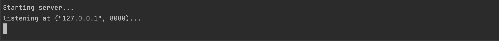
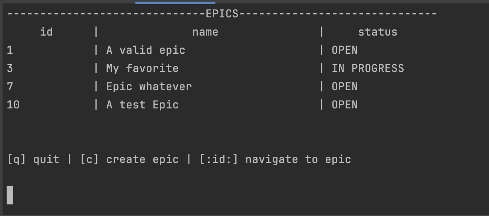

# Async Jira CLI
## Description
An asynchronous in-memory-database server and client. The database is inspired from the popular Jira. Epics can be added to the database, and each Epic can have its own set of Stories.
Any client can connect to the server using the client executable. The actor model was used to manage shared state between different asynchronous tasks. The protocol for the client connecting to
the server was built over Tcp. Any client can execute the typical CRUD operations for modifying the database.

### Goals
This was my first project that used asynchronous Rust code extensively. So the main goal of this project was to learn how to write asynchronous Rust code and how to build something that used message passing between tasks. In addition, I wanted to gain more practice with file io
so the 'database', is really just raw bytes being written to and read from text files.

## Usage
To run this code one needs to clone this repository to their local machine then follow the instructions for running the client or server, respectively.

### Server
After cloning the repository to your local machine, one needs to run the server passing in the appropriate command line arguments. For example, the command to start the server on my local machine with a test database is: 

`RUST_LOG=error cargo run --bin server -- -d /Users/benjaminhaase/development/Personal/async_jira_cli/src/test_database -f test.txt -e test_epics -c 1000 -a 127.0.0.1 -p 8080`

After executing the above command the server will display

It is a little verbose to start the server. The command line arguments provide the following configuration options for the server.

| -d | -f | -e | -c | -a | -p |
| --- | --- | --- | --- | --- | --- |
| The path to the directory where the in memory database is located | The name of the text file that represents the database | The directory that will contain all of the epics (it should be located in the database directory) | The size of the channel buffer for the main broker task, limits the number of clients that can connect at once | The address the server will listen for incoming requests | The port of the server |

> Note: The server will not create a new database directory, text file or epic directory for you. The database must already exist. In order to create a new database, one only has to create a new directory containing another directory for epics and an empty text file. Then when starting the server the appropriate path(s) and file name should be passed as command line arguments.

### Client
Once one has a server running, a new client can connect to the server. For example say we wanted to run a client that connects to the server that was run previously. Opening a new terminal window and running the command `cargo run --bin client -- 127.0.0.1 8080` will allow us to connect a new client to the server. We just pass the address of the server and the port. After doing so the client terminal is greeted with

